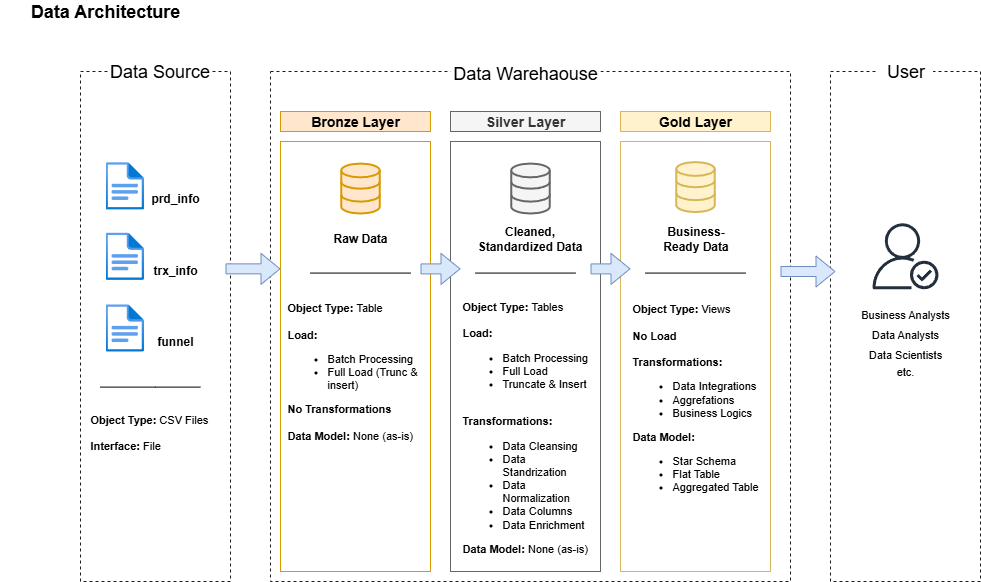

# Data Warehouse Project With SSMS

## Overview
Implementation of a **star schema** data warehouse for e-commerce analytics, complete with a comprehensive data integration flow from raw data to ready-to-use business insights.

## 🏗️ Data Architecture

## Data Flow

## Star Schema

## ⚡ Quick Start
### Prerequisites
- SQL Server 2016+
- SSMS (SQL Server Management Studio)
- Basic understanding of T-SQL

### Installation
1. Clone the repository
  'https://github.com/nnandaftri/sql_data_warehouse.git'
2. Execute setup scripts in order:

3. Run the complete pipeline:

## 📋 TODO & Roadmap
- Real-time data integration
- Advanced data quality framework
- Machine learning integration
- Cloud deployment scripts
- Docker containerization

## 📄 License
This project is licensed under the [MIT License](https://github.com/nnandaftri/sql_data_warehouse/blob/main/LICENSE). You are free to use, modify, and share this project with proper attribution.
